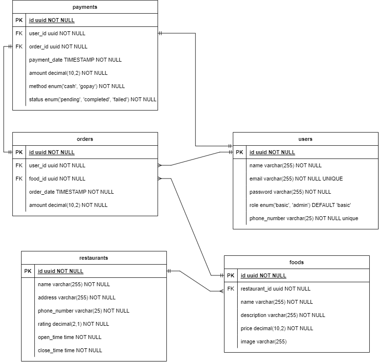

# Project Brief: Modular Monolith for Gojek-like Services
Gojek App is implemented with microservices with (might be) hundred of services such as:
User Service, GoFood, GoPay, GoRide, GoMart, GoShop, GoSend, Subscription Service, Reward Service, and etc. 

This project aims to replicate key services of Gojek using a Modular Monolith architecture. Unlike the distributed microservices architecture Gojek uses, this project will consolidate core functionalities into a single codebase, making it easier to manage and develop in the initial stages. The focus will be on implementing basic CRUD of User, Payment, and Food services, utilizing Node.js and PostgreSQL, to showcase how modular components can coexist within a monolithic structure.

<div align="center">

  

</div>

## Tech Stack
- Node.js with ExpressJS: For building RESTful APIs.
- TypeScript: For adding static type definitions to JavaScript, enhancing code quality and understandability.
- OpenAPI: For documenting the APIs, ensuring they are clear and easy to use.
- PostgreSQL: As the relational database to store and manage application data.
- Turborepo: To manage the monorepo setup, ensuring efficient handling of multiple packages within the same repository.

## Getting Started
```
  git clone <this_repo>
  cd go-services
  npm install
```
## Development
Follow these steps to prepare your development environment:
1. Prepare the Database - Import the database schema and initial data:
   ```
     psql -d <db_name> -U <db_username> -f dump.sql
   ```
2. Environment Variables - Copy the .env.example to .env and fill in the necessary variables:
3. Start the Development Server:
   ```
     npm run dev
   ``` 

### Apps and Packages

- `user`: Manages user services such as login and registration.
- `food`: Handles food services, including restaurant listings and order management.
- `payment`: Manages payment processing and transactions.
- `@repo/middlewares`: Contains shared middleware, database connections, and Swagger configurations for API documentation.
- `@repo/eslint-config`: Includes eslint configurations
- `@repo/typescript-config`: Houses TypeScript configuration.

## API Documentation
API Documenation is separated for each service, can be accessed from
`<service_url>/docs`
e.g. User service run in `localhost:3000`, docs can be accessed from `localhost:3000/docs`
